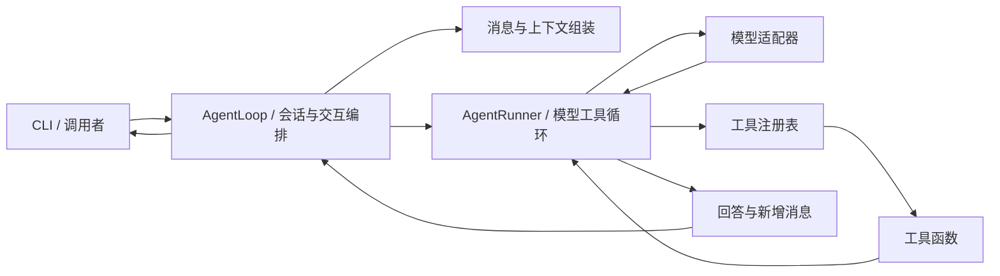

# mini-LearnGraph：以 Agent 内核为中心的 MVP 方案

>
> 第一目标：实现一个能持续对话、调用工具并根据结果继续工作的 Agent。学习能力随后以指令、上下文和工具扩展。
>
> 核心边界：AgentLoop 编排一轮用户交互，AgentRunner 执行这一轮中的模型—工具循环。两者均采用轻量实现。
>
> 本文不依赖原 LearnGraph、nanobot 源码或历史对话。阶段 A 已按本文结构实现，验收状态见 [执行计划](exec-plans/completed/agent-mvp.md)。真实模型验证需要模型地址、模型 ID 和密钥。

## 1. 首版要完成什么

首版交付一个 Python Agent 内核与交互式 CLI，跑通以下过程：

```text
用户输入 → 组装消息 → 调用模型
                      ├── 工具调用 → 执行工具 → 回传结果 → 再次调用模型
                      └── 最终回答 → 展示答案 → 继续下一轮对话
```

完成标准是：模型能够使用时间查询和计算工具解决任务，保留本次进程中的对话历史，并在工具出错时尝试修正。

第一阶段只做 Agent。HTTP API、流式输出和会话保存按需要后续增加；学习模块在内核跑通后接入。

### 1.1 最小可靠性边界

首版保留模型请求超时、最大模型调用轮数、工具参数校验和明确错误。这些直接防止执行卡死或无限循环。

首版不建设 Run 状态机、RunRecorder、执行检查点、持久事件、SSE 重放、请求幂等、任务队列、自动恢复、通用 Hook 框架或审计系统。进程退出后可以丢失历史；用户重新发起任务，不承诺恢复已执行步骤。

前端、沙箱、语音、多租户、MCP、联网研究、长期记忆和子 Agent 也不进入首版。

## 2. 架构：AgentLoop 与 AgentRunner



| 组件 | 职责 |
| --- | --- |
| AgentLoop | 接收一轮输入、读取内存历史、获取领域上下文、组装消息、调用 Runner、更新历史并返回结果 |
| AgentRunner | 对已组装消息执行模型—工具循环，控制最大轮数，返回新增消息与停止原因 |
| ModelProvider | 转换模型请求与响应，返回统一的文本、工具调用和结束原因 |
| ToolRegistry | 提供工具定义，查找工具，校验并执行调用 |
| ContextBuilder | 合并指令、历史、当前输入及可选领域上下文 |
| CLI | 读取输入、调用 Loop、展示结果，处理 /reset 和 /exit |

工具执行逻辑放在注册表中即可，首版无需再拆 Registry、Executor、Recorder 等层。上下文组装从函数开始，有实际复杂度时再变成类。

Loop 代表一段内存会话，持有历史、指令和可选上下文提供函数；Runner 不持有会话历史，也不读取领域数据。一个 Loop 的多次输入复用同一个 Runner。首版顺序调用，不建设消息总线、会话管理平台或调度器。

### 2.1 目录

```text
mini-learngraph/
├── README.md
├── .env.example
├── pyproject.toml
├── uv.lock
├── mini_learngraph/
│   ├── __init__.py
│   ├── cli.py             启动、输入和结果展示
│   ├── loop.py            AgentLoop：内存会话与上下文编排
│   ├── runner.py          AgentRunner：模型—工具循环
│   ├── types.py           Message、ToolCall、ModelResponse、AgentResult
│   ├── context.py         消息组装
│   ├── provider.py        模型协议与 OpenAI 兼容适配器
│   ├── tools.py           工具注册、参数校验和两个基础工具
│   └── config.py          模型配置
└── tests/
    ├── fakes.py           固定模型响应
    ├── test_loop.py
    ├── test_runner.py
    ├── test_tools.py
    └── test_provider.py
```

此结构已落地；测试还包含配置与 CLI 验收，原仓库的 Node.js 工具继续保留。学习模块加入时再创建 learning/，不用提前创建空的服务、仓储或插件目录。

## 3. 消息与模型契约

### 3.1 最小类型

| 类型 | 必需内容 |
| --- | --- |
| Message | role、content、可选 tool_calls 和 tool_call_id |
| ToolCall | id、name、arguments |
| ModelResponse | content、完整工具调用列表、finish_reason；可选 usage |
| AgentResult | final_text、messages、stop_reason、可选 error |

AgentResult.messages 是 Runner 新增的 assistant/tool 消息，不包含传入的 system、历史或当前 user 输入。Loop 在成功时将本轮实际发给模型的 user 消息和这些新增消息追加到内存历史；final_text 已包含在对应 assistant 消息中，不能重复追加。final_text 只表示模型回答或部分回答，错误说明放在 error 中，不伪造 assistant 回答消息。

Runner 构造时只注入 Provider、工具注册表和 max_steps。Loop 构造时注入 Runner、指令和可选上下文提供函数。调用形式如下，具体类型按上表实现：

```python
runner = AgentRunner(provider=provider, tools=registry, max_steps=8)
loop = AgentLoop(runner=runner, instructions=instructions)
result = await loop.process(user_input)
print(result.final_text)
if result.error:
    print(result.error)
```

第一阶段采用非流式模型调用，以便先验证工具循环。ModelProvider 提供异步 chat(messages, tools) 方法，使用 httpx 调用 OpenAI Chat Completions 兼容接口。Provider 负责角色、工具 Schema 与 JSON 参数字符串的转换。

模型配置必须包含非空地址、模型 ID 和密钥，max_steps 必须为正整数。每次 chat 调用用 asyncio.timeout 限制总耗时，httpx 同时设置连接和读取超时；单独的 httpx 读取超时不等于整次请求时限。CLI 负责创建并在退出时关闭 Provider 的 HTTP 客户端。

Loop 的 process(user_input) 内部调用 runner.run(messages)。Runner 复制传入消息作为工作上下文，单独收集自己生成的消息，返回时不把输入消息再次放进 Result。Loop 不自行执行工具，Runner 不自行更新 Loop.history。

### 3.2 工具调用配对

必须保存模型发出的 assistant 工具调用消息，再追加对应 tool 结果。下一次模型请求至少包含以下配对结构：

```json
[
  {"role": "user", "content": "计算 (12 + 8) / 5"},
  {
    "role": "assistant",
    "content": null,
    "tool_calls": [{
      "id": "call_1",
      "type": "function",
      "function": {
        "name": "calculate",
        "arguments": "{\"expression\":\"(12 + 8) / 5\"}"
      }
    }]
  },
  {
    "role": "tool",
    "tool_call_id": "call_1",
    "content": "4"
  }
]
```

同轮多个工具顺序执行，结果通过调用 ID 配对。所有调用均得到成功或明确错误结果后，再请求模型继续。不能把工具结果当作普通 user 消息，也不能遗漏其中某个结果。

### 3.3 结束与错误

- finish_reason 为 stop、回答非空且无工具调用：stop_reason 为 completed。
- 模型请求失败或超时：返回 model_error，携带可读错误说明。
- 调用 ID 缺失或重复、工具参数不是合法 JSON 对象、结束原因与响应不一致：返回 invalid_response，不执行该响应中的任何工具。
- finish_reason 为 tool_calls 时，调用列表必须非空且完整有效，才允许执行；其他结束原因即使附带调用也不执行工具。
- 输出截断、过滤或空回答：分别返回 output_truncated、content_filtered 或 empty_response，保留可展示的模型文本。
- 达到 max_steps：返回 step_limit，说明任务未完成；不追加模型收尾调用。

失败时，结果消息可保留给调用者查看，但 Loop 不将失败轮次加入历史，避免留下未闭合工具链。工具错误本身不立即终止 Runner，模型可以在剩余轮数内修正。

上下文提供函数的异常由 Loop 转为 context_error，不调用 Runner，也不更新历史。模型或工具中的未预期异常返回对应错误，并在 CLI 中显示；取消异常继续向上传播。错误信息应简短，不包含密钥或完整请求头。

## 4. 两层循环如何实现

### 4.1 AgentLoop：编排一轮用户交互

1. 接收原始 user 输入，读取当前内存历史。
2. 如果配置了上下文提供函数，调用它获取当前领域数据。该函数可为同步或异步，Loop 统一处理。
3. 使用上下文组装函数构造 system、历史和当前输入；领域数据作为带目标/节点标识的数据快照附在当前 user 消息中。
4. 调用 Runner，取得 AgentResult。
5. 仅在 completed 时追加实际输入的 user 消息（含本轮上下文快照）与新增 assistant/tool 消息到历史，返回结果给 CLI。system 指令不重复存入历史。

历史中的上下文快照表示当时的节点与状态，新一轮重新获取当前快照，不改写旧数据。这样切换节点后，模型仍能理解“刚才那个概念”等追问。首版历史只在内存中，不为快照引入数据库或额外存储层。

reset() 只清空当前 Loop.history。Loop 首版不处理并发输入、后台投递、恢复或持久化。

### 4.2 AgentRunner：执行模型—工具循环

1. 复制 Loop 传入的完整消息，初始化空的新增消息列表。
2. 最多调用模型 max_steps 次，默认值为 8，每次实际请求占一轮。CLI 将配置值传入 Runner，不能硬编码覆盖配置。
3. 校验响应。如果没有工具调用且正常结束，追加 assistant 回答并返回结果。
4. 如果有合法工具调用，先检查是否还剩一次模型调用机会；没有则返回 step_limit，不执行工具。否则追加完整 assistant 消息。
5. 逐个查找和执行工具，将成功文本或错误文本包装为对应 tool 消息。
6. 把这些消息加入工作上下文，再次调用模型。
7. 请求错误、协议异常或轮数耗尽时返回明确的非成功结果。

模型适配器按请求保存状态，不使用共享 last_usage 传递本轮结果。Runner 不原地修改输入消息，也不把本次运行状态保存在可影响下一次调用的实例字段中。

max_steps 统计模型请求次数，默认 8；工具调用不额外占轮数，但其结果需要下一轮模型请求处理。不能在预算最后一轮执行工具后直接丢弃结果。消息复制应覆盖可变的嵌套工具参数，不仅复制列表外壳。

首版不自动重试模型或工具。不支持运行中追加新输入。CLI 等待 Loop.process 返回后才接受下一轮输入；用户可以通过 Ctrl+C 停止当前任务或进程，不提供跨进程取消接口。

CLI 为每次 process 调用设置普通异常边界：展示简短错误后继续接收输入，失败轮次不追加历史。CancelledError 和 KeyboardInterrupt 不当作普通业务错误吞掉，按取消或退出处理。

## 5. 工具协议

每个工具只需要四部分：名称、说明、Pydantic 参数模型、异步执行函数。参数模型导出 JSON Schema，同时用于验证模型实参；设置 extra="forbid"，不静默忽略未知参数。工具函数返回文本，复杂数据可先编码为 JSON 文本。

注册表按名称稳定排序工具 Schema，同名注册报错。只执行精确匹配的名称，不自动把近似名称替换成真实工具。

未知工具、参数校验失败和可预期执行错误返回简短文本，例如“Error: timezone 必须是有效时区”，供模型修正。异步工具默认限时 10 秒，超时返回工具错误；纯计算工具先限制输入复杂度，避免阻塞事件循环。未预期的实现异常终止本轮并返回 tool_error，避免把程序缺陷反复交给模型重试。取消异常向上传播，不包装成可继续执行的工具错误。

### 5.1 默认工具

| 工具 | 参数 | 行为 |
| --- | --- | --- |
| get_current_time | timezone: str，默认 UTC | 返回时区和带偏移的 ISO 8601 时间，使用 zoneinfo |
| calculate | expression: str | 计算数字、括号、一元正负号及 + - * / |

calculate 通过受限 AST 遍历实现，不使用 eval/exec；限制表达式长度、节点数量及数值范围。拒绝变量、属性和函数调用，除零返回错误。时间工具使用可替换时钟，便于固定测试。

首版两个工具没有业务写入。学习阶段加入写操作时，在对应领域服务中处理校验和业务去重，不为了未来写工具提前建设通用可靠执行平台。

## 6. 上下文与学习扩展

### 6.1 首版上下文

按协议顺序发送 system 指令、历史、当前 user 输入，之后追加本轮 assistant/tool 链。可选领域上下文作为明确标记的数据块加入当前输入，在指令中声明其为参考数据。工具可用范围由注册表控制，不能只靠提示词限制权限。

首版用于短对话，Loop 保留当前进程的完整历史。CLI 的 /reset 调用 Loop.reset()，/exit 退出。模型上下文超限时明确报错并提示重置，不实现自动摘要、长期记忆或复杂 token 治理。

工具定义较少时全部提供，不实现动态发现。CLI 只允许使用服务端注册工具，用户输入不决定注册权限。

### 6.2 学习模块的三个接入点

| 接入点 | 学习模块提供内容 |
| --- | --- |
| instructions | 教学方式、解释深度和反馈规则 |
| context | 当前目标、节点、前置知识和近期作答 |
| tools | 节点查询、练习生成、作答判分和下一步建议 |

先为学习会话配置教学指令、节点上下文提供函数和学习工具，构造 AgentLoop，跑通“节点讲解 → 生成练习 → 作答反馈”。复用同一个 AgentRunner 类，无需另写学习执行循环。目标或节点数据的读取放在 Loop 的上下文提供函数及领域工具中。

目标图谱、证据与学习状态随后作为领域数据加入。模型生成候选图谱，服务端校验后由用户发布；作答产生证据，领域服务根据规则更新学习状态。当前节点绑定由服务端提供，不通过模型实参扩大范围。

工具需要绑定目标或节点时，为该学习会话构造独立工具实例或闭包，不把当前绑定写进跨会话共享实例。出现真实并发需求后，再评估独立执行上下文。

## 7. 从 nanobot 借鉴什么

本方案借鉴 HKUDS/nanobot 的设计思想，已经在本文展开，不要求获取其源码：

| 设计 | 本项目采用方式 |
| --- | --- |
| AgentLoop 与 AgentRunner 分离 | Loop 管理内存会话、输入和上下文；Runner 执行模型—工具循环；CLI 只处理交互 |
| Provider 隔离模型协议 | 核心使用统一响应，首版只有一个兼容适配器 |
| 工具注册与模型错误修正 | Pydantic Schema、精确名称、错误回传、稳定排序 |
| 历史保留角色与调用关系 | 保存 assistant/tool 配对，失败轮次不污染后续历史 |
| 领域指令与上下文扩展 | 学习能力通过指令、数据和工具接入 |

不照搬渠道总线、复杂 Hook、检查点、子 Agent 或自动记忆。RunRecorder 是此前方案自行引入的抽象，并非 nanobot 必须组件，现已移出首版。

## 8. 实施顺序与验收

| 阶段 | 交付内容 | 完成标准 |
| --- | --- | --- |
| A：Agent MVP | AgentLoop、AgentRunner、Provider、工具、上下文函数和 CLI | 固定模型桩跑通工具循环和多轮对话，单独报告真实模型验证状态 |
| B：学习样例 | 学习指令、固定节点上下文和少量领域工具 | 同一内核跑通节点讲解与练习反馈 |
| C：按需求服务化 | HTTP、流式展示、简单会话保存 | 根据实际使用决定范围，不作为 A/B 的前置条件 |

A 阶段必须验证：直接回答、单工具、同轮多工具、多轮工具、错误参数修正、模型错误、非法调用响应、最大轮数和失败历史处理。使用固定模型桩检查下一次请求中的真实消息配对，不只检查最终文本。

Runner 测试直接传入组装好的消息，独立验证执行逻辑、嵌套输入不变性，以及最后一轮不再执行工具。Loop 测试用假 Runner 验证上下文组装、成功追加、失败不追加、无重复消息、上下文提供失败和 reset；两层组合测试验证连续追问及切换节点后的历史快照。测试模型的过滤/截断响应即使携带工具调用也不得执行。

真实模型样例包括时间查询、计算、一个同时需要两个工具的任务，以及依赖上文的追问。记录模型 ID 和测试结果，不保存密钥。模型桩测试与真实模型验证分别报告；缺少配置时继续完成实现与桩测试，明确真实模型尚未验证。

## 9. 依赖、启动与交付

运行依赖：Python 3.11+、httpx、Pydantic、pydantic-settings 和 tzdata。测试使用 pytest，可配 pytest-asyncio，放入 uv 默认安装的 dev 依赖组。uv 管理环境和锁文件。第一阶段无需 FastAPI、SQLAlchemy、Redis、图数据库或 Agent 框架。

.env 位于项目根目录，配置读取根据文件位置解析，不依赖运行目录。至少配置以下变量：

```dotenv
MINI_LEARNGRAPH_MODEL_BASE_URL=https://api.example.com/v1
MINI_LEARNGRAPH_MODEL_ID=your-model-id
MINI_LEARNGRAPH_MODEL_API_KEY=replace-me
MINI_LEARNGRAPH_MAX_STEPS=8
MINI_LEARNGRAPH_REQUEST_TIMEOUT_SECONDS=60
```

实现应提供以下命令：

```bash
uv sync --locked
uv run python -m mini_learngraph.cli
uv run pytest
```

交付源代码、锁文件、配置示例、README、测试和真实模型验证记录。README 说明安装、启动、支持的模型协议，以及“历史只在内存中，进程退出后丢失”的首版限制。
